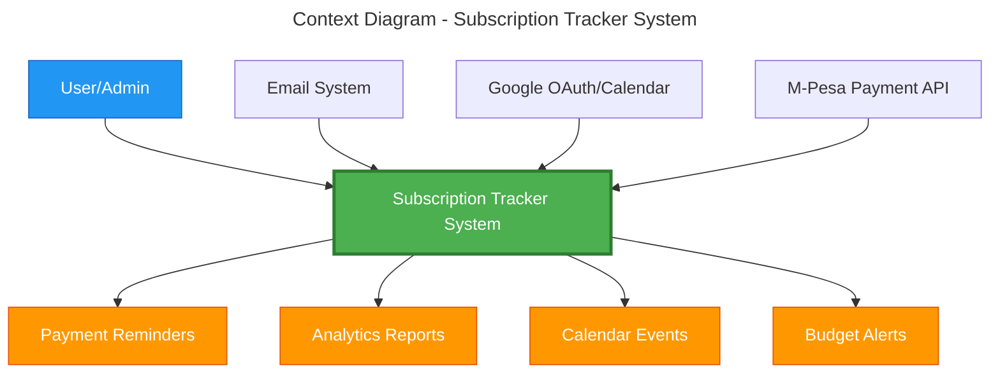
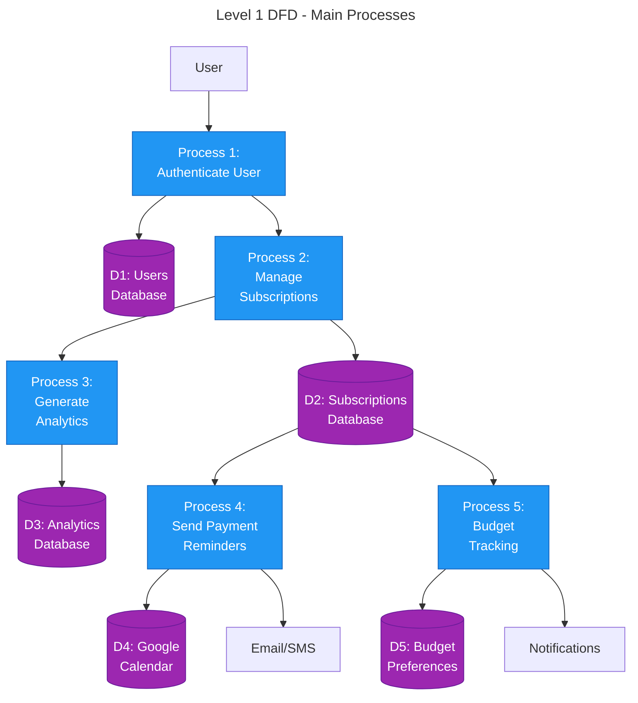
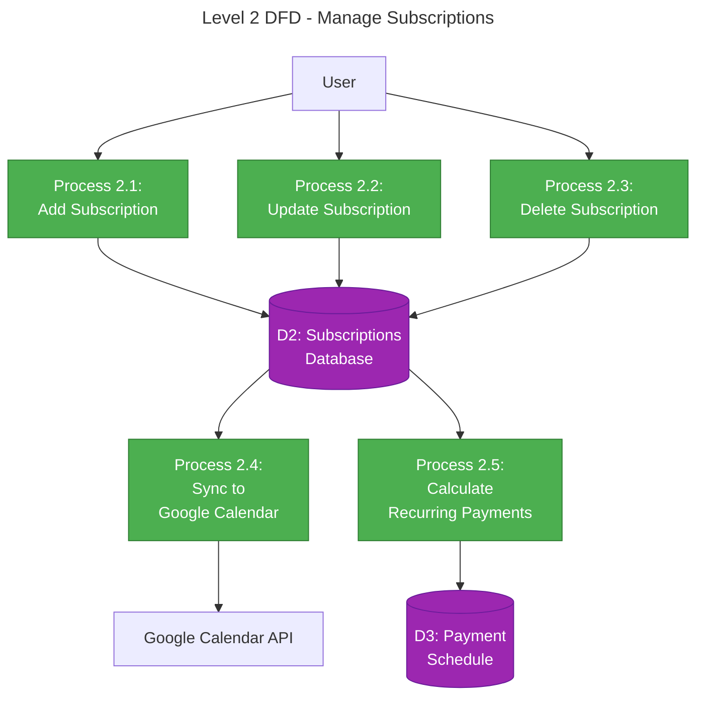
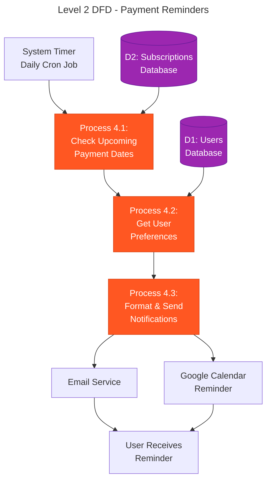
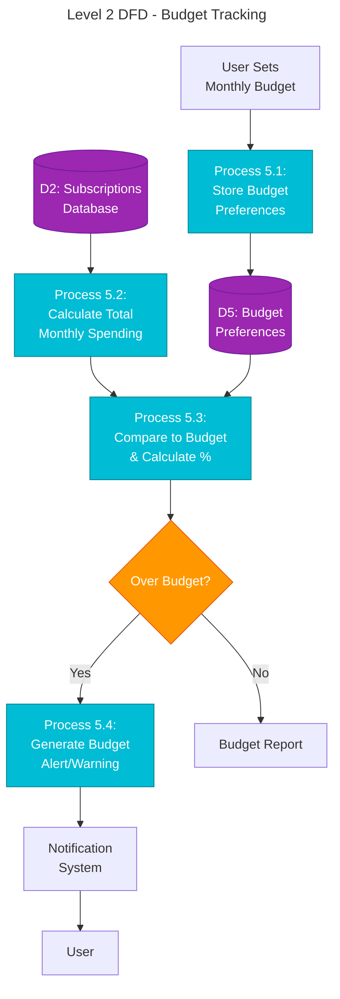

# Data Flow Diagrams (Mermaid Format)

These diagrams can be rendered in GitHub, VS Code (with Mermaid extension), or online at https://mermaid.live/

## Context Diagram (Level 0)

## Level 1 DFD - Main Processes

## Level 2 DFD - Manage Subscriptions Process

## Level 2 DFD - Payment Reminders

## Level 2 DFD - Budget Tracking

---

## How to View These Diagrams:

1. **GitHub**: Push to GitHub and they'll render automatically
2. **VS Code**: Install "Markdown Preview Mermaid Support" extension
3. **Online**: Copy code to https://mermaid.live/
4. **Export**: Use mermaid.live to export as PNG/SVG/PDF
