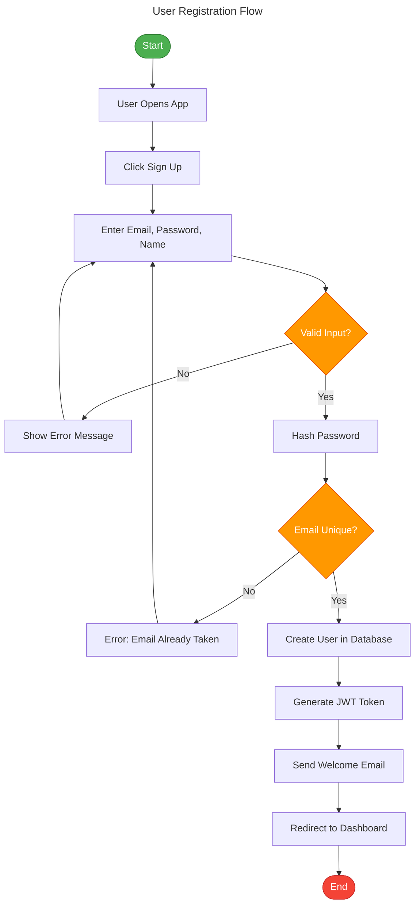
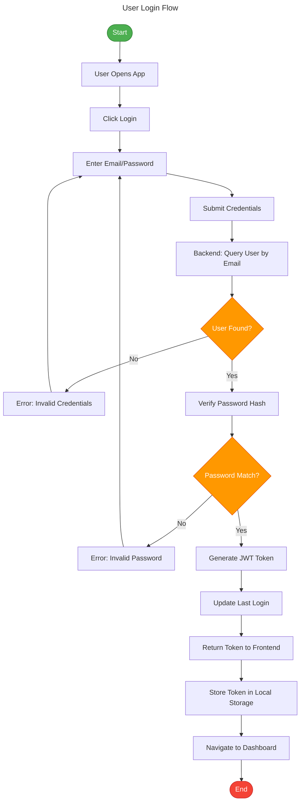
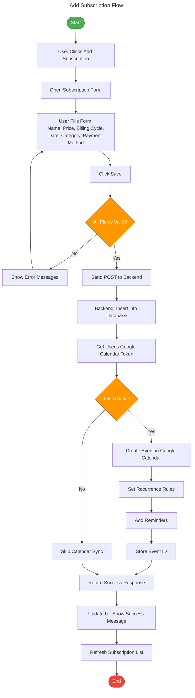
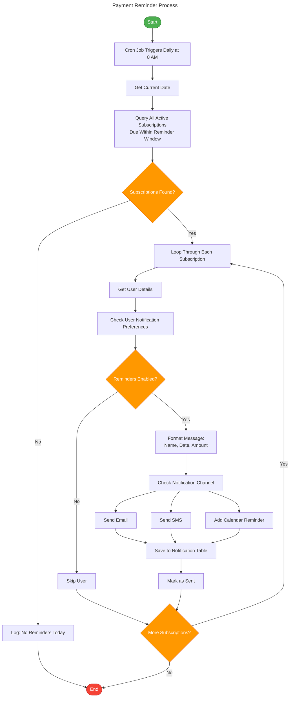
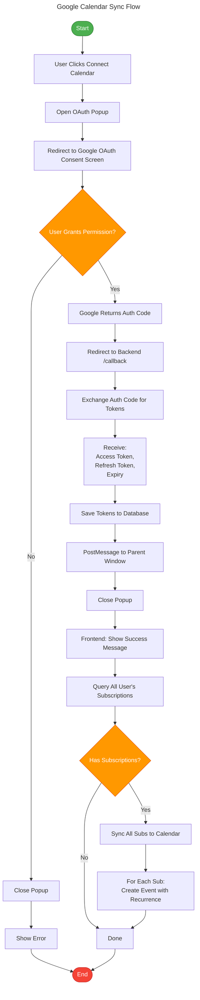
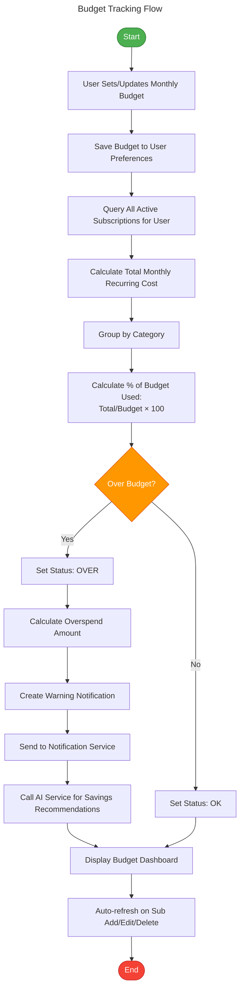
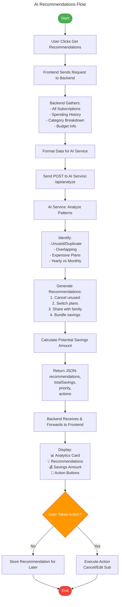
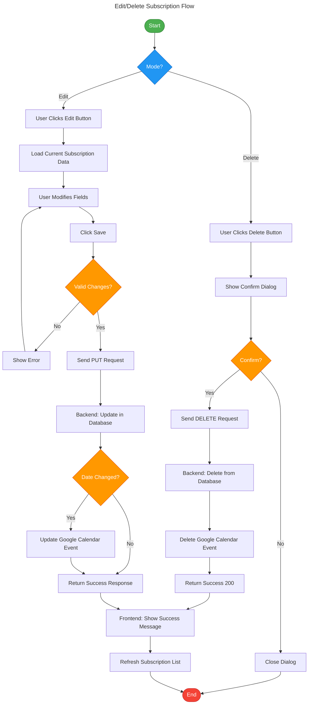

# Flowcharts (Mermaid Format)

## 1. User Registration Flow

## 2. User Login Flow

## 3. Add Subscription Flow

## 4. Payment Reminder Process

## 5. Google Calendar Sync Flow

## 6. Budget Tracking Flow

## 7. AI Recommendations Flow

## 8. Edit/Delete Subscription Flow

---

## How to Use These Diagrams:

### **Option 1: View in VS Code** (Recommended)
1. Install extension: "Markdown Preview Mermaid Support"
2. Open any `.md` file
3. Press `Ctrl+Shift+V` (Windows) or `Cmd+Shift+V` (Mac)
4. Diagrams render beautifully!

### **Option 2: View & Export Online**
1. Go to https://mermaid.live/
2. Copy any diagram code
3. Paste into the editor
4. Click "Download PNG" or "Download SVG"

### **Option 3: GitHub**
- Push to GitHub - diagrams render automatically in README files

### **Option 4: Export to PowerPoint/PDF**
1. Use mermaid.live to export as PNG (high resolution)
2. Insert images into PowerPoint presentation
3. Add titles and descriptions
