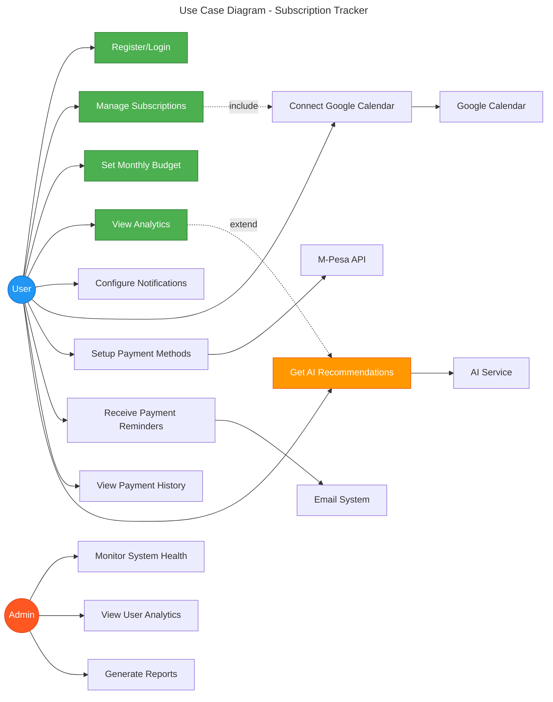
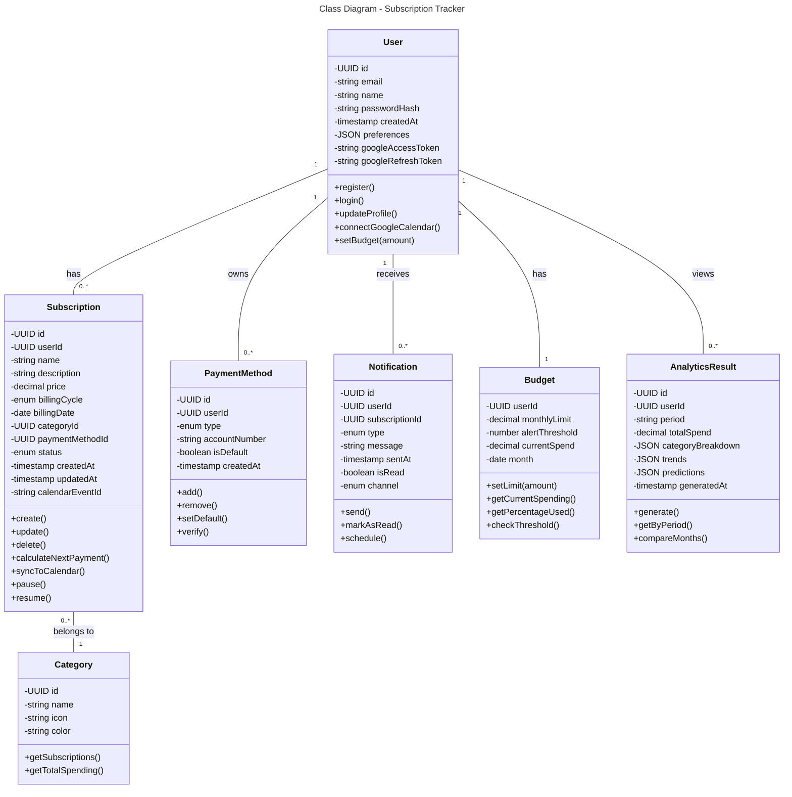
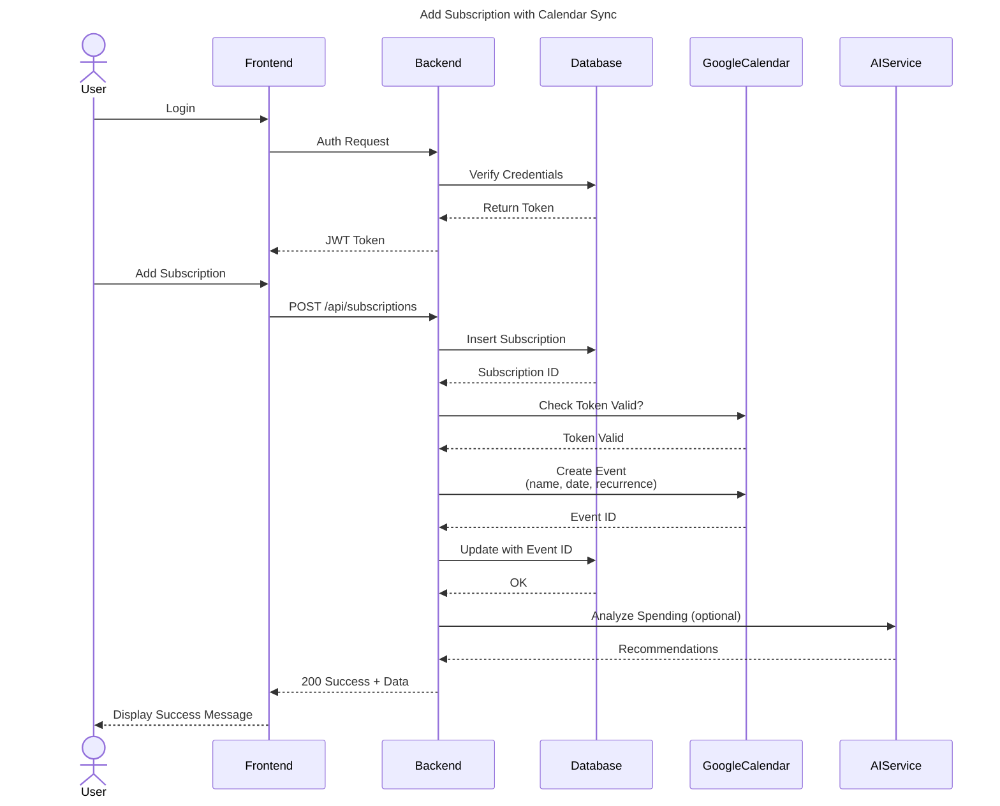
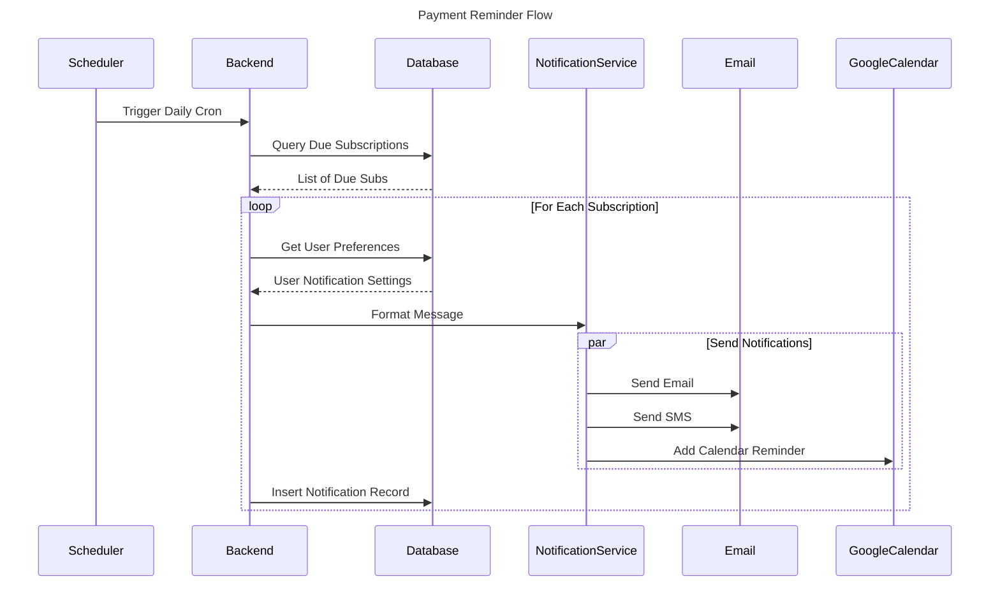
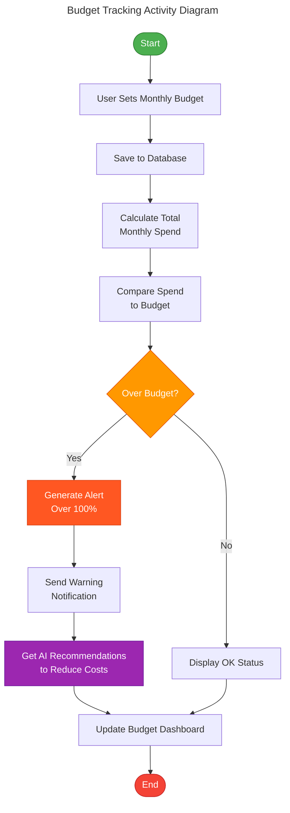
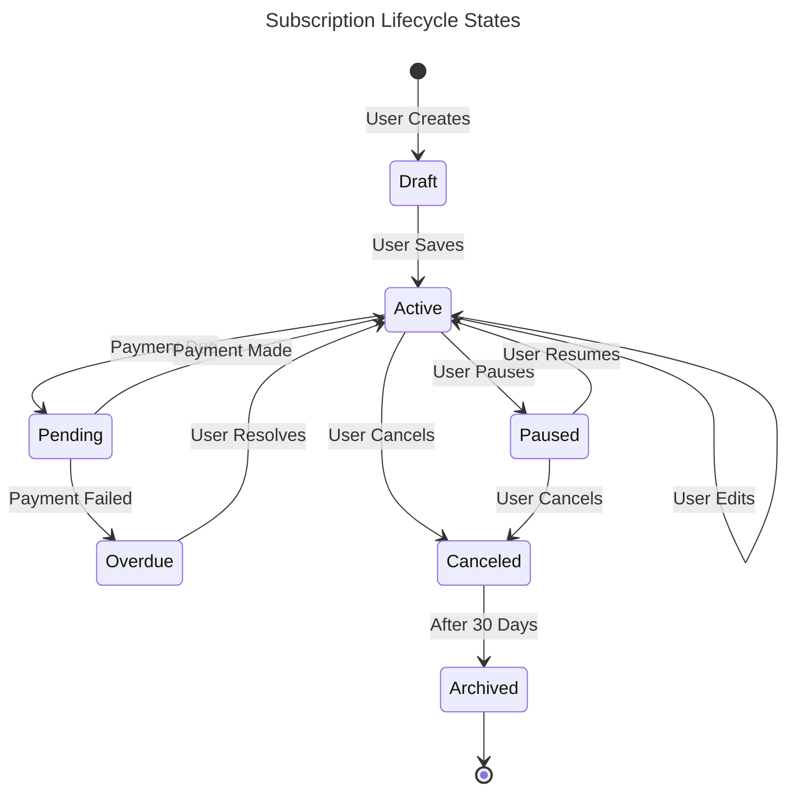
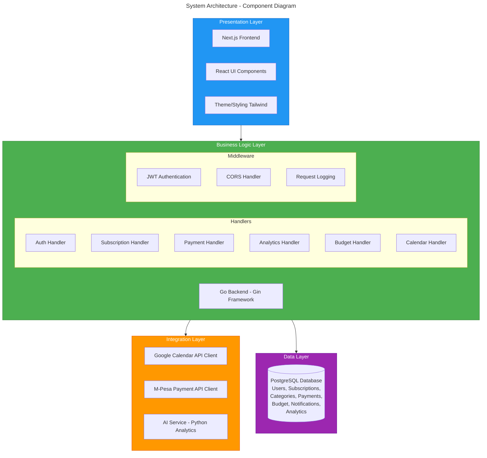

# UML Diagrams (Mermaid Format)

## Use Case Diagram

## Class Diagram

## Sequence Diagram - Add Subscription with Calendar Sync

## Sequence Diagram - Payment Reminder Flow

## Activity Diagram - Budget Tracking

## State Diagram - Subscription Lifecycle

## Component Diagram

---

## How to View & Export:

1. **View in VS Code**: Install "Markdown Preview Mermaid Support" extension
2. **View Online**: Visit https://mermaid.live/ and paste the code
3. **Export**: Use mermaid.live to export as PNG, SVG, or PDF
4. **GitHub**: Push to GitHub - diagrams render automatically
